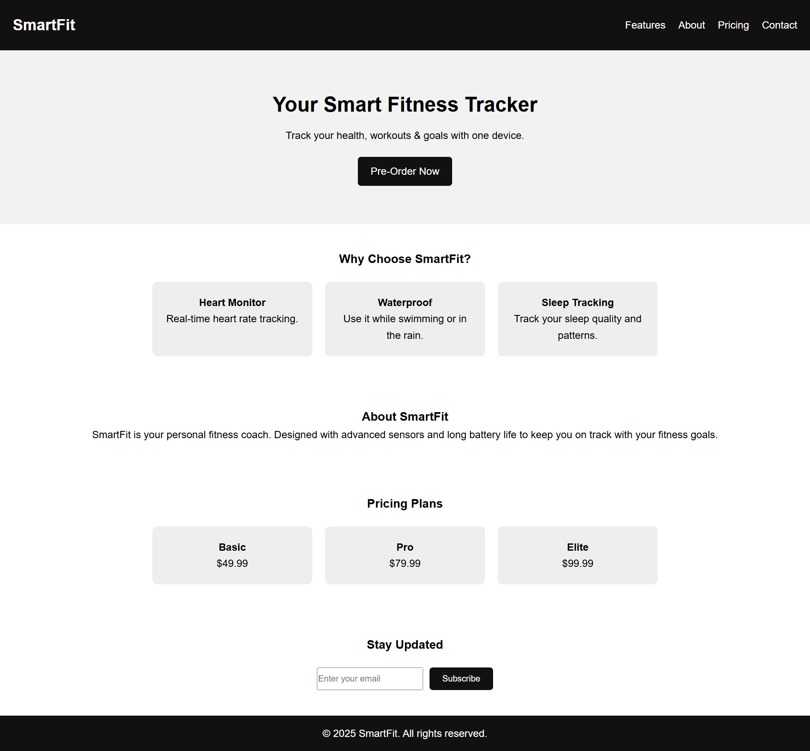

# 🏋️‍♂️ SmartFit - Product Landing Page

A modern, responsive **Product Landing Page** built using  **HTML5** and **CSS3**. This page showcases a fictional fitness tracker brand — **SmartFit** — and demonstrates a clean layout, section navigation and responsive design.

---

## 🔗 Live Demo

👉 [Click here to view the live project](https://codewithokasha.github.io/SmartFit-Landing-Page/)  


## 📸 Screenshot

  


## 📚 Project Description

The **SmartFit Landing Page** is a one-page product showcase designed for fitness brands, or personal projects. It's a great demonstration of:

- ✅ Semantic HTML5 layout  
- ✅ Responsive design using Flexbox   
- ✅ Real-world business use case (Product Landing Page)


## 🛠️ Technologies Used

- **HTML5** — for semantic structure  
- **CSS3** — for layout, responsiveness, and styling  

---

## ✨ Features

- 📱 Fully responsive design for all screen sizes  
- 🔗 Smooth section-to-section navigation  
- 💡 Organized structure for real-world projects

---

## 📂 Folder Structure

```bash
SmartFit-Landing-Page/
├── index.html        # Main HTML structure
├── style.css         # Styling using pure CSS
├── screenshot.png    # Page preview image
└── README.md         # Project documentation
